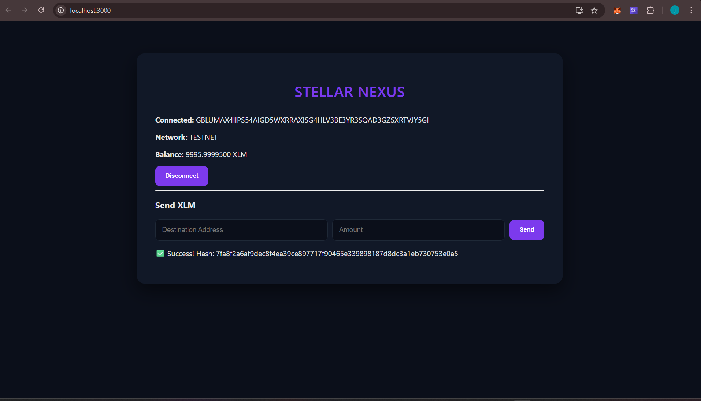

#  Stellar Nexus

A clean and minimal Stellar testnet wallet dApp built with React and Freighter. Connect your wallet, check your XLM balance, and send transactions — all on the Stellar testnet.

---

##  Live Demo


https://stellar-nexus-lake.vercel.app


---

##  Features

-  Connect / Disconnect Freighter wallet
-  Display real-time XLM balance
-  Send XLM transactions on Stellar testnet
-  Transaction success feedback with hash
-  Error handling for failed transactions
-  Testnet network verification

---

## 🛠 Tech Stack

- **React** — Frontend UI
- **@stellar/stellar-sdk** — Stellar transaction building & submission
- **@stellar/freighter-api** — Wallet connection & transaction signing
- **Stellar Horizon API** — Testnet account & balance fetching

---

##  Installation

```bash
# Clone the repository
git clone https://github.com/YOUR_USERNAME/stellar-nexus.git

# Navigate into the project
cd stellar-nexus

# Install dependencies
npm install

# Start the development server
npm start
```

---

##  Setup & Usage

### 1. Install Freighter Wallet
Download the [Freighter browser extension](https://www.freighter.app/) and create or import a wallet.

### 2. Switch to Testnet
In Freighter settings, switch the network to **Testnet**.

### 3. Fund Your Wallet
Get free testnet XLM from the Stellar Friendbot:
```
https://friendbot.stellar.org?addr=YOUR_PUBLIC_KEY
```

### 4. Connect & Transact
- Click **Connect Freighter** to link your wallet
- Your XLM balance will display automatically
- Enter a destination address and amount to send XLM
- Approve the transaction in Freighter
- View your transaction hash on success

---

##  Project Structure

```
src/
├── App.js              # Main application component
├── wallet.js           # Freighter wallet connect/disconnect logic
├── stellar.js          # Balance fetching via Horizon API
├── transaction.js      # XLM transaction building & signing
└── index.css           # Global styles
```

---

## 📸 Screenshots

### Wallet Connected


### Balance Displayed


### Successful Transaction


### Transaction Result


##  Key Implementation Details

**Wallet Connection** — Uses `@stellar/freighter-api` to request access and retrieve the user's public key.

**Balance Fetching** — Queries the Stellar Horizon testnet API to get the native XLM balance for the connected account.

**Transaction Flow** — Builds a payment operation using `TransactionBuilder`, signs it via Freighter, and submits it to the Horizon testnet.

**Error Handling** — Handles unfunded accounts, invalid inputs, network mismatches, and failed transactions gracefully.

---

##  Important Notes

- This app runs on **Stellar Testnet only** — no real funds are used
- You must have the **Freighter extension** installed to use this app
- New wallets must be funded via Friendbot before they appear on-chain

---

##  Stellar White Belt — Level 1

This project was built as part of the **Stellar Developer White Belt** program covering:
- Wallet setup and integration
- Balance fetching and display
- Sending XLM transactions on testnet
- Error handling and user feedback

---

##  License

MIT License — free to use and modify.

---

Built with ❤️ on Stellar Testnet
